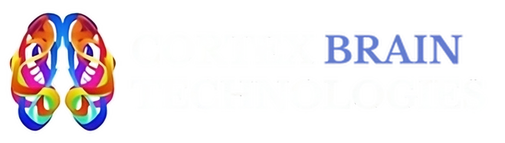

# Cortex Brain Technologies
=========================

Welcome to the official GitHub Organization of **Cortex Brain Technologies**!

About Us
--------

At Cortex Brain Technologies, we are revolutionizing the way people with neurocognitive conditions, such as ADHD, autism, and depression. interact with our Brain-Computer Interface (BCI) through innovative and accessible neurofeedback technology. Our mission is to empower individuals by providing at-home BCI headsets designed to improve quality of life through real-time neurofeedback therapy.

### Our Vision

To make neurofeedback technology affordable and accessible for all, improving the lives of millions of individuals worldwide affected by neurological conditions.

### Our Technology

Our research and development are focused on building novel **BCI headsets** that allow users to engage in neurofeedback therapy from the comfort of their homes. By leveraging cutting-edge neuro-sensors, we aim to democratize access to treatments that can help reduce symptoms associated with:

*   Autism
*   ADHD
*   Depression
*   Alzheimer’s
*   Epilepsy
**and more**

## We combine advanced neuroscience, technology, and a deep understanding of the challenges faced by individuals with neurocognitive conditions.

Why It Matters
--------------

With the prevalence of autism and ADHD on the rise, many families face financial and logistical barriers to accessing neurofeedback therapy. Our goal is to remove these barriers, offering a solution that is not only effective but also financially feasible.

How We Work
-----------

We value collaboration and transparency. Our GitHub repositories house a range of open-source and proprietary projects that span:

*   **BCI Software Development Kits (SDKs)**
*   **Neuro-sensor technology prototypes**
*   **Machine learning models for neurofeedback analysis**
*   **BCI device APIs**

We welcome contributions from developers, neuroscientists, and innovators worldwide.

Get Involved
------------

Whether you are a developer, researcher, or just someone passionate about advancing neurotechnology, we invite you to collaborate with us. Together, we can shape the future of BCI technology and improve lives.
